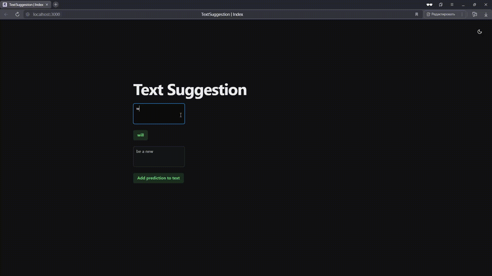

# Text suggestion

## Цель проекта:

Реализовать систему, предлагающую удачное продолжение слова или несколько следующих слов в режиме реального времени.

## Пример использования:

# 1. Реализация префиксного дерева

## Описание

Классы `PrefixTree` и `PrefixTreeNode` реализуют префиксное дерево для эффективного хранения и поиска слов. 

## `PrefixTreeNode`

### Описание

Узел в префиксном дереве. Представляет собой символ и содержит ссылки на дочерние узлы, а также флаг, указывающий, является ли текущий узел концом слова.

### Атрибуты

- **`children`**: Словарь, где ключи — символы, а значения — дочерние узлы для текущего символа.
- **`is_end_of_word: bool`**: Флаг, указывающий, является ли текущий узел концом слова.

## `PrefixTree`

### Описание

Узел в префиксном дереве. Каждый узел представляет собой символ и содержит ссылки на дочерние узлы, а также флаг, указывающий, является ли текущий узел концом слова.

#### **Атрибуты**

- **`root`**: Корневой узел префиксного дерева.  

#### **Методы**
- **`Конструктор`**: Инициализирует объект с заданным корпусом текста.
- **`search_prefix`**: Возвращает все слова, начинающиеся на `prefix`.

# 2. Реализация WorldCompletor

## `WorldCompletor`

#### **Атрибуты**

- **`word_count_dict: dict[str, float]`**: Словарь, где ключ — слово, а значение — его частота, нормированная по общему числу слов в корпусе.
- **`words_count: int`**: Общее количество слов в корпусе.
- **`prefix_tree: PrefixTree`**: Префиксное дерево для поиска слов по их префиксу.
 
#### **Методы**

- **`Конструктор`**: Инициализирует объект с заданным корпусом текста.
- **`get_words_and_probs`**: Возвращает список слов, начинающихся с указанного префикса, и их вероятности.

# 3. Реализация n-граммной модели

### `NGramLanguageModel`

#### **Атрибуты**

- **`n`**: Максимальная длина N-грамм, используемая в модели.

- **`ngram_counts`**: Счётчик частот всех N-грамм в корпусе. Ключ — N-грамма (в виде кортежа), значение — её частота.

- **`context_counts`**: Счётчик частот контекстов (первых `n-1` слов в N-грамме). Ключ — контекст (в виде кортежа), значение — частота.

#### **Методы**

- **`Конструктор`**: Инициализирует N-граммную языковую модель на основе заданного корпуса.
- **`get_next_words_and_probs`**: Возвращает список слов, которые могут следовать за заданным префиксом, и их вероятности.

# 4. Генерация текста

### `TextSuggestion`

#### **Атрибуты**

- **`word_completor`**: Объект класса `WordCompletor`, отвечающий за дополнение последнего слова в тексте до целого слова.

- **`n_gram_model`**: Объект класса `NGramLanguageModel`, использующий n-граммную модель для предсказания следующих слов.

#### **Методы**

- **`конструктор`**: Инициализирует объект с объектами `WordCompletor` и `NGramLanguageModel`.
- **`suggest_text`**: Возвращает возможные варианты продолжения текста.

# 5. Реализация UI с помощью Reflex

### Описание

Интеграция с Reflex позволяет преобразовать систему генерации следующих слов в полноценное веб-приложение с удобным интерфейсом для пользователя. Это упрощает взаимодействие с системой и предоставляет доступ к её возможностям без необходимости установки локального программного обеспечения или использования командной строки.

### `text_suggestion.py`

#### **Переменные**

- **`CLEAR`**: Флаг для запуска очистки данных при запуске системы.
- **`DATASET_FILE_NAME`**: Название файла с датасетом.
- **`N_WORDS`**: Число слов, которые дописывает n-граммная модель.
- **`N_TEXTS`**: Число возвращаемых продолжений.
- **`N`**: Максимальная длинна N-грамм.

# 6. Результаты.

Система способна дополнять слова, написанные пользователем, а так же дописывать текст.

